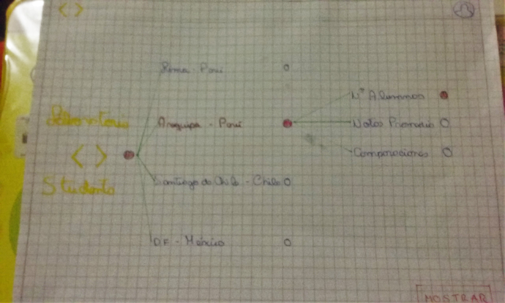
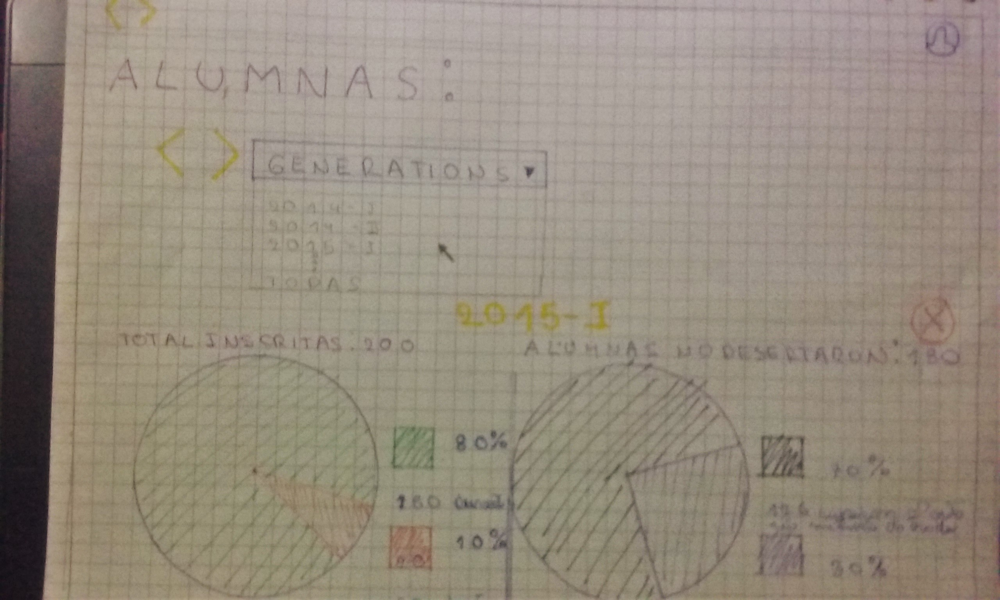
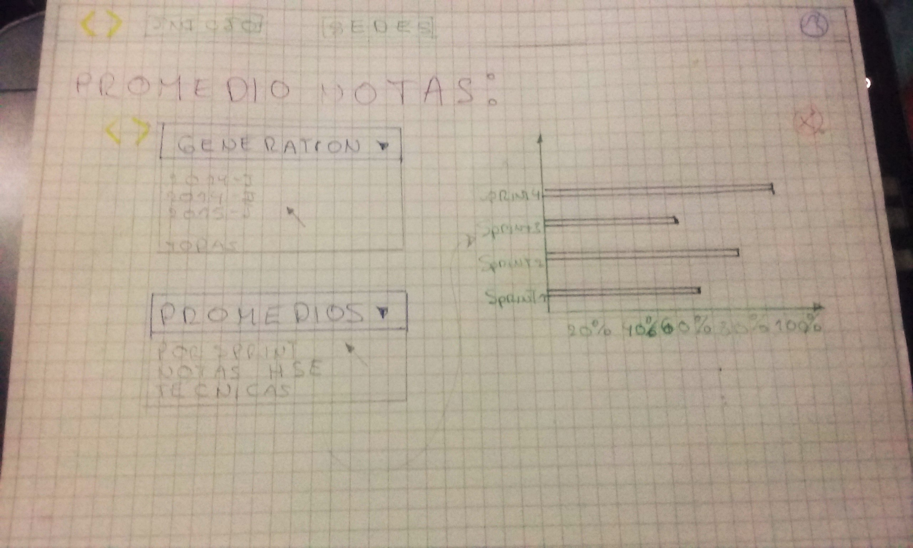
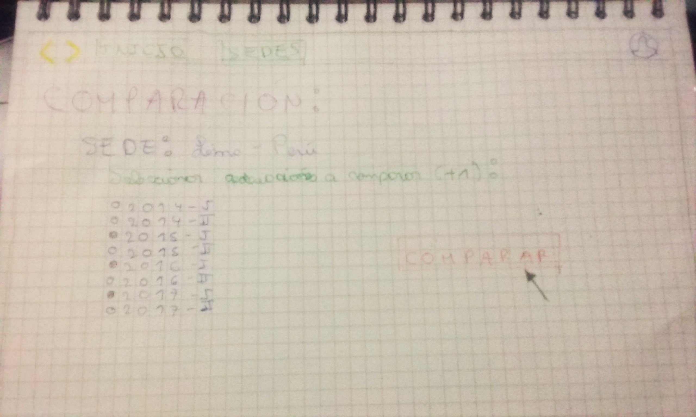
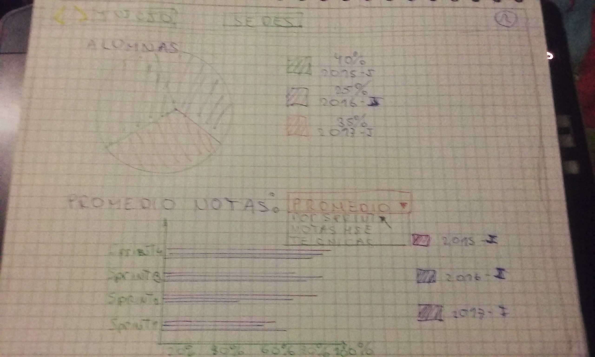

# RETO 3

***

El dashboard es una herramienta utilizada por profesores, training managers, directores y gerentes de Laboratoria para ver rápidamente qué está pasando en el salón de clases de Laboratoria. En el dashboard, los usuarios mencionados pueden ver rápidamente estadísticas y datos en tiempo real como:

* de alumnas inscritas
* de alumnas que desertaron
* % de alumnas que pasan el criterio mínimo de evaluación
* Promedio de notas por sprint
* Promedio de notas HSE
* Promedio de notas técnicas

* En la página de inicio:

  1. Contamos con la selección para todo laboratoria o por sedes a elegir, y al elegir una sede se desplaza la selección de opciones (alumna, promedios y comparaciones)

  

  2. Al seleccionar la sede que deseamos, y alumnas nos muestra los siguiente:

  

  3. Al seleccionar la sede que deseamos, y los promedios nos muestra los siguiente:

  

  4. Al seleccionar la sede que deseamos, y la comparación nos muestra los siguiente:

  

    * Luego de seleccionar las generaciones que deseamos comparar, nos muestra lo siguiente:

      
